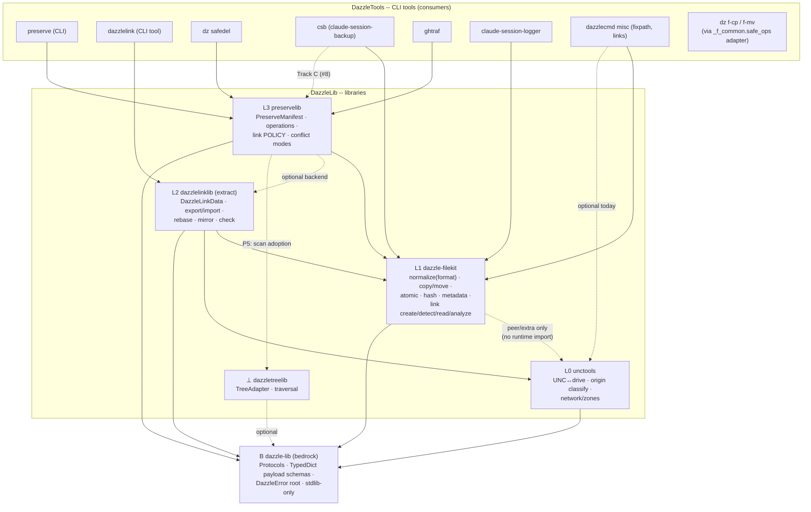

# The DazzleLib Stack Map -- Architecture Contract (v1.0, FROZEN 2026-06-11)

> The single source of truth for what belongs where across the DazzleLib libraries.
> Every capability has exactly one home; dependencies only point down. Amendments
> require a dated ADDENDUM section and re-ratification.
>
> Tracking epic: [DazzleLib/.github#3](https://github.com/DazzleLib/.github/issues/3) -
> Roadmap: [#1](https://github.com/DazzleLib/.github/issues/1). Design history lives in
> the maintainers' internal design documents (referenced by filename in the epics).

## The five domains (the rules)

1. **Every capability has exactly ONE home**, chosen by responsibility -- not by which repo needed it first.
2. **Dependencies only point DOWN** the layer diagram. Never up, never sideways. *License-guard corollary:* the MIT libraries (L0, L1, ⊥) must never runtime-import the GPL libraries (L2, L3); GPL-consuming-MIT downward is fine.
3. **Sibling-library imports are REAL dependencies** (declared in pyproject). The `try: import X` graceful-fallback pattern is reserved for *platform capability* (pywin32, symlink privilege) -- never for library presence. Optional sibling imports are how forks are born. **`sys.path.insert` bundled-path fallbacks are banned outright** (see P3: the preservelib.dazzlelink one gets deleted, not carried forward). *Extras discipline (D2):* optional INTEGRATIONS may use declared pyproject extras, but the integration surface must raise a hard, NAMED error when the extra is missing (the f-cp `PRESERVELIB_AVAILABLE` sentinel pattern) -- never silently degrade, never reimplement.
3a. **L0 purity = probe, never mutate (D7).** The identity layer may READ the filesystem (stat, access, exists-with-variants) to answer identity questions; it may never mutate or transfer content. Content I/O begins at L1.
4. **Libraries live in the DazzleLib org; user-facing CLI tools live in DazzleTools** and consume the libraries.
5. **Uniform naming, three axes, no exceptions (D9): dist `dazzle-<name>` · import `dazzle_<name>` · repo `DazzleLib/dazzle-<name>`.** Tools keep their human names; libraries wear the uniform. The formal layout:

| Layer | Dist | Import | Repo | Change |
|---|---|---|---|---|
| B | `dazzle-lib` | `dazzle_lib` | `DazzleLib/dazzle-lib` | new (Phase F) |
| L0 | `dazzle-unctools` (pointer) -> real dist `unctools` | `unctools` | `DazzleLib/UNCtools` | **AMENDED (D9a)**: codeless pointer dist only; import/repo unchanged; full rename preserved as a later 1.0-style option |
| L1 | `dazzle-filekit` | `dazzle_filekit` | `DazzleLib/dazzle-filekit` | none (the convention's archetype) |
| L2 | `dazzle-linklib` | `dazzle_linklib` | `DazzleLib/dazzle-linklib` | new (P2; D1 import AMENDED to conform) |
| L3 | `dazzle-preservelib` | `dazzle_preservelib` | `DazzleLib/dazzle-preservelib` | new (P3; supersedes the earlier "import stays `preservelib`" lean -- all consumers are ours, P4 fixes them) |
| ⊥ | `dazzle-treelib` (pointer) -> real dist `dazzletreelib` | `dazzletreelib` | `DazzleLib/dazzle-tree-lib` | **AMENDED (D9a)**: codeless pointer dist only (P5); import/repo unchanged; full rename preserved as a later option |

Pointer dists (D9a): `dazzle-unctools` and `dazzle-treelib` are codeless pointer dists depending on the real `unctools`/`dazzletreelib` -- permanent by design (Rule 6 carve-out), tracked in the alias register as POINTER.
7. **New-name hygiene (D4):** before exporting a public symbol, grep the stack for the name. Same-name-same-semantics -> one-home consolidation. Same-name-different-semantics -> layer-teaching renames. Per-repo api-stability canaries + the stack-wide audit tool enforce it.
6. **Shim-alias policy: temporary, noisy, tracked, terminal.** During a migration, a renamed/moved symbol MAY keep a shim alias whose ONLY purposes are (a) surfacing breakage sites loudly (DeprecationWarning/log line naming the new home and the removal version) and (b) keeping consumers limping while the audit-tool sweep runs. Every shim is registered in the alias register (the maintainers' violation register) at creation with its slated removal version; a shim that ships past its removal version is itself a violation. Silent aliases are banned -- a shim that doesn't warn defeats its own purpose. *Carve-out (D9a): CODELESS POINTER DISTS are exempt -- a PyPI dist containing nothing but metadata and a dependency on the real dist has no code to rot and no import to mislead; it is permanent by design (house precedent: `dazzlecmd`/`dazzle-dz`). Pointer dists are still registered in the alias register with status POINTER.*

| Layer | Domain | Library | Answers the question |
|---|---|---|---|
| B | **Bedrock contracts** | `dazzle-lib` *(new, D10)* | "What can every stack object be expected to do (view/serialize), and what shapes do cross-layer payloads have?" Protocols + TypedDicts + exception root. Stdlib-only, MIT, behavior-free by charter. |
| L0 | **Path identity** | `unctools` | "Is this path UNC / network / subst / local -- and what is its other name?" (May probe read-only; never mutates -- rule 3a.) |
| L1 | **Filesystem primitives** | `dazzle-filekit` | "Do ONE thing to ONE filesystem object, correctly, on every OS." |
| L2 | **Link serialization** | `dazzle-linklib` *(extraction; D1 resolved)* | "Represent a link as durable portable DATA and rehydrate it anywhere." |
| L3 | **Operation orchestration** | `preservelib` *(new repo)* | "Do MANY things as a transaction: manifest, verify, conflict policy, rollback." |
| ⊥ | **Traversal** | `dazzletreelib` | "Visit a tree efficiently" -- orthogonal engine, usable from any layer. |

## Dependency chain (Mermaid)

Solid arrow = declared runtime dependency. Dashed = optional extra / future / policy-allowed exception (each one named).

## Full class & API map (per library, post-consolidation target)

### B `dazzle-lib` (NEW -- D10; dist `dazzle-lib`, import `dazzle_lib`, repo `DazzleLib/dazzle-lib`; MIT, stdlib-only forever)

The org's namesake bedrock. **Charter (exhaustive, not indicative):**

| Kind | Name | Notes |
|---|---|---|
| Protocol | `Viewable` | `__str__` / `summary()` expectations |
| Protocol | `Serializable` | `to_dict` / `from_dict` / `to_json`, `SCHEMA_VERSION` -- structural (`runtime_checkable`), nothing forced to subclass |
| TypedDicts | `FileMetadataDict`, `TimestampsDict`, `LinkTargetDict`, hash-result shape, ... | THE cross-layer payload schemas; L1+ function signatures take/return these; rich objects (DazzleLinkData, PreserveManifest, LinkInfo, OperationResult) serialize INTO them -- "the dict is the interface" (generalizes the review-F1 adapter) |
| Exceptions | `DazzleError` root + per-domain bases | one catchable root for the stack |
| Mixin | `DazzleDataMixin` (optional) | derives `to_json`/`__str__` from `to_dict` |

**Banned forever:** I/O, path handling, platform probing, "utils", anything with side effects -- a PR adding behavior is rejected on sight. **Admission: rule of two** (a contract enters only when 2+ libraries need it). `dazzletreelib` adoption is optional (it stays zero-dep and independently useful).

### L0 `unctools` (0.1.0, PyPI ✓, DazzleLib/UNCtools)

| Kind | Name | Notes |
|---|---|---|
| class | `UNCConverter` | mapping cache; `refresh_mappings()`, `get_mappings()` -- becomes the ONLY UNC↔drive enumeration in the stack (absorbs dazzlelink's `UNCAdapter` use case + deprecates filekit's `get_drive_mappings`) |
| fns | `convert_to_local` / `convert_to_unc` / `normalize_path(prefer_unc)` | path IDENTITY normalization (which name), not format |
| fns | `is_unc_path`, `is_network_drive`, `is_subst_drive`, `get_drive_type`, `get_path_type` | origin classification (`unc/network/subst/local/...`) -- NAME COLLISION with filekit's `get_path_type` (object kind); documented, not merged (D4) |
| fns | `parse_unc_path` / `join_unc_path`, `get_subst_target`, `get_network_target`, `get_network_mappings`, `detect_path_issues`, `is_server_in_intranet_zone` | |
| mod | `operations` -- **D7 RESOLVED (split per rule 3a)** | STAY (identity probes / path algebra): `get_unc_path_elements` + `build_unc_path` (move into `converter`), `file_exists(check_both_paths)`, `is_path_accessible`, `find_accessible_path`. DELETE (content I/O at L0, zero consumers verified): `safe_open`, `safe_copy`, `batch_copy`, `process_files`, `replace_in_file(s)`. The retry-with-converted-path pattern is preserved as a DOCUMENTED future filekit capability (`path_variant_resolver` hook, unctools becomes a real L1->L0 dep when actually consumed) -- built on demand, not on symmetry. |
| fns (utils.compat) | `path_exists_case_sensitive`, `get_case_sensitive_path` | **D8 RESOLVED: migrate to filekit** (merge with its `fix_path_case` into one L1 implementation in 0.3.0); deleted here. Canonical casing is format/normalization, not identity. |
| mod | `windows.security`: `get_file_security`, `set_file_permissions`, `take_ownership`, `check_access_rights`, `get_unc_share_permissions` | ACL INSPECTION/MUTATION for access decisions (vs filekit = snapshot/restore) |
| mod | `windows.network`: mapping create/remove, `get_all_network_mappings`, shares | |
| mod | `windows.registry`: intranet-zone management | |

### L1 `dazzle-filekit` (0.2.4 -> 0.3.0, PyPI ✓, DazzleLib/dazzle-filekit, src *(maintainer-local path)*)

| Kind | Name | Notes |
|---|---|---|
| class | `DiskUsage`, `InsufficientSpaceError` | utils.disk |
| fns (paths) | `normalize_cross_platform_path` (+ `normalize_path`, `normalize_path_no_resolve` wrappers), `is_same_file`, `split_drive_letter`, `is_unc_path`, `get_relative_path`, `create_dest_path`, `find_files`, `find_regex_files`, `ensure_unique_path`, `get_path_type` (object kind), `create_parent_dirs` | format/syntax normalization (WSL/MSYS/`\\?\`/env/tilde) |
| fns (ops) | `copy_file`, `move_file`, `copy/move_files_with_path`, `remove_file/directory`, `create_directory_structure`, `atomic_write_text/json`, `copy_tree_preserving_links` | |
| fns (links) | `create_symlink` | **0.3.0: absorbs dazzlelink's elevation-aware `create_windows_symlink`; drops the dazzlelink soft-import (kills the latent L1->L2 cycle)** |
| fns (links, NEW 0.3.0) | `create_junction` (PowerShell `New-Item -ItemType Junction`), `create_hardlink`, `read_link_target`, `analyze_link` -> `LinkInfo` | ported from preservelib WITH the fixed `is_junction` (DeviceIoControl `FSCTL_GET_REPARSE_POINT` + `IO_REPARSE_TAG_MOUNT_POINT`); kills preservelib's cmd.exe `mklink /j` and its junction-detection bug at the source |
| fns (metadata) | `collect_file_metadata`, `apply_file_metadata`, `restore_windows_creation_time`, `is_win32_available`, `compare_metadata`, `metadata_to_json`, `collect_timestamp_info`, `apply_timestamp_strategy` | the ONE metadata snapshot/restore implementation (SDDL string, owner/group, attrs, xattrs, ctime) |
| fns (verification) | `calculate_file_hash`, `verify_file_hash`, `verify_files_with_manifest`, `calculate_directory_hashes`, `save/load_hashes_to_file`, `compare_directories`, `verify_copied_files` | the ONE hashing implementation |
| fns (platform.windows) | `is_admin`, `detect_alternate_streams`, `has_significant_ads` | ADS = detect-only stack-wide (round-trip is an explicit non-feature until a consumer demands it) |
| fns (utils.compat) | `is_windows/unix/wsl`, `is_admin/root`, `resolve_cross_platform_path`, `path_exists_cross_platform`, `fix_path_separators/case`, `get_app_data_dir`, ... | `get_drive_mappings` DEPRECATED -> unctools (D3) |

### L2 `dazzlelinklib` (EXTRACTION from the dazzlelink tool -- D1 RESOLVED)

**D1 resolved (review + user uniformity call): dist `dazzle-linklib`, import `dazzlelinklib`, repo `DazzleLib/dazzlelinklib`. The TOOL keeps the `dazzlelink` name, dist, and CLI entry point** (DazzleTools). Review data: the only live library consumers of `import dazzlelink` are preservelib's subpackage (rewritten in P3 anyway) and filekit's soft-import (deleted in P1) -- so option (b)'s "zero churn" advantage had no surviving referent, while it would have silently stripped the CLI from existing `pip install dazzlelink` users.

Source today: *(maintainer-local path)* (TOOL, DazzleTools org, repo 0.7.0 / PyPI 0.6.1, midstream packaging migration -- see 0-fork).

**Extraction caveat (review F1): the timestamp-strategy delegation is NOT drop-in.** dazzlelink's `apply_timestamp_strategy(link, dl_data: DazzleLinkData, ...)` reads timestamps off the L2 object; filekit's takes pre-extracted `(link_timestamps, target_timestamps)` dicts. Phase 2 must write a thin L2 adapter that unpacks `DazzleLinkData` into filekit's dicts -- the unpacking is L2-domain code and stays in the lib.

| Goes to the LIB | Stays in the TOOL (DazzleTools) | Deleted (delegated down) |
|---|---|---|
| `DazzleLinkData` (.dazzlelink JSON format, schema v1, legacy embedded-script reader) | `cli:main` + argparse UX | `UNCAdapter` -> unctools (`net use` enumeration) |
| `export_link`, `import_link`, `create_link`, `recreate_link` | `execute` / `execute_dazzlelink` (open target -- desktop UX) | `set_file_times`, `collect_timestamp_info` -> filekit metadata |
| `find_dazzlelinks`, `scan`, `check` (+fix), `rebase`, `mirror`, batch ops | file-association scripts (`scripts/*.ps1/.bat`) | `_collect_file_attributes`, `restore_file_attributes` -> filekit |
| timestamp STRATEGY semantics (`current/symlink/target/preserve-all`) -- applied via filekit | `DazzleLinkConfig` rc-file layering (user UX); per-file EMBEDDED config stays with the format in the lib | MD5 checksum inline -> filekit verification |
| `DazzleLinkException` | | `create_windows_symlink` -> filekit 0.3.0 |

### L3 `preservelib` (NEW repo *(maintainer-local path)* -> DazzleLib; dist `dazzle-preservelib`, import `preservelib`)

Canonical source: *(maintainer-local path)* + safedel snapshot's metadata shim. Three vendored copies retire (preserve-embedded, safedel `_lib` junction, ghtraf `preserve_lib`).

| Kind | Name | Notes |
|---|---|---|
| class | `PreserveManifest` | JSON manifest v3 (lineage DAG, operations, files, hashes); **roadmap: persist per-file metadata dict (known gap); hardlink inode-group field + re-link** |
| class | `OperationResult` | copy/move/restore/verify outcome |
| class | `LinkInfo` + `LinkHandlingMode` | **Split clarified (review F4): filekit's `LinkInfo` carries ONLY intrinsic properties** (kind=symlink/junction/hardlink, raw_target, resolved_target, is_broken, is_circular-chain) -- stateless, no operation context. The destination-RELATIVE fields (`target_is_destination`, `target_inside_destination`, `target_contains_destination`) are MOVE-context and stay at L3 (a `LinkRelationship` struct or inline in `detect_path_cycles_deep`); `creates_cycle_with(dest)` is L3 logic, full stop. `LinkHandlingMode` policy stays L3. |
| enums | `FileCategory`, `ConflictResolution` | **D5 RESOLVED (review F7): ghtraf's values are byte-for-byte identical** to preservelib's (same 7 ConflictResolution, same 4 FileCategory). P4 ghtraf migration = swap the import path; no reconciliation exists to do. |
| fns | `copy_operation`, `move_operation`, `restore_operation`, verify ops, `create_manifest_for_path`, `read_manifest`, `find_available_manifests`, `calculate/verify_file_hash` (thin over filekit) | manifest lifecycle PULLED DOWN from the preserve CLI so library consumers get write/read/discover/verify without the CLI |
| subpkg | `preservelib.dazzlelink` | optional backend bridging manifests <-> .dazzlelink files (`dazzlelink_to_manifest`, `manifest_to_dazzlelinks`, ...) -- becomes a REAL dep on dazzlelinklib per rule 3, or an extra `[dazzlelink]` (D2) |
| deleted | `links.py` creation/detection bodies | -> filekit calls (junction/hardlink/symlink creation, is_junction, get_link_target) |

### ⊥ `dazzletreelib` (0.10.3, PyPI ✓, DazzleLib/dazzle-tree-lib, src *(maintainer-local path)* MIT)

| Kind | Name |
|---|---|
| core | `TreeNode`, `TreeAdapter` (abstract) |
| config | `TraversalConfig`, `TraversalStrategy`, `DataRequirement`, `CacheStrategy`, `FilterConfig`, `DepthConfig`, `PerformanceConfig`, `ExecutionPlan` |
| sync | `FileSystemNode`, `FileSystemAdapter`, `traverse_tree`, `collect_tree_data`, `count_nodes`, `find_nodes`, `get_tree_paths`, `get_leaf_nodes`, `get_tree_stats` |
| aio | `AsyncFileSystemNode`, `AsyncFileSystemAdapter`, `AsyncFilteredFileSystemAdapter`, `TimestampCalculationAdapter`, `SmartCachingAdapter`, `DepthTrackingAdapter`, `traverse_tree_async` (+depth/level variants), `filter_by_depth`, `collect_metadata_async` |

No dependency on or from the rest of the stack (rule: any layer MAY adopt it for traversal; none must).

## Capability ownership (one home each)

| Capability | Owner | Displaces |
|---|---|---|
| Path FORMAT normalization (slashes, `\\?\`, WSL/MSYS, env, tilde) | filekit | dazzlelink `_normalize_path`, preservelib partials |
| Path IDENTITY (UNC↔drive, origin classification, subst) | unctools | dazzlelink `UNCAdapter`, filekit `get_drive_mappings` |
| Symlink create (elevation-aware) / detect / read target | filekit 0.3.0 | dazzlelink `create_windows_symlink`, preservelib `_create_symlink`/`get_link_target` |
| Junction create (PowerShell) + detect (DeviceIoControl) | filekit 0.3.0 | preservelib `_create_junction` (cmd.exe) + buggy `is_junction` |
| Hardlink create | filekit 0.3.0 | preservelib `_create_hard_link` |
| Broken-link / link-kind ANALYSIS (`LinkInfo` read-only) | filekit 0.3.0 | preservelib `analyze_link` |
| Link POLICY during operations (block/skip/unlink, cycles) | preservelib | (stays) |
| Metadata snapshot/restore (times, ctime, SDDL, attrs, xattrs) | filekit | dazzlelink timestamps/attrs, preservelib stale metadata.py, ghtraf copy |
| ACL inspection/mutation for ACCESS decisions | unctools.windows.security | (distinct from filekit's snapshot/restore -- both call GetFileSecurity, different purpose) |
| Hashing / verification | filekit | dazzlelink inline MD5, preservelib thin-wraps |
| ADS detection (round-trip = explicit non-feature for now) | filekit.platform.windows | -- |
| Link-as-portable-DATA (.dazzlelink schema, export/import/rebase) | dazzlelinklib | -- |
| Manifest lifecycle + transactional copy/move/restore/verify | preservelib | preserve CLI internals |
| Tree traversal | dazzletreelib | ad-hoc `os.walk` in dazzlelink scan / preservelib discovery (P5, optional) |
| Relative-path computation (abs->rel, cross-drive fallback) | filekit (NEW row, review F6) | dazzlelink `batch.py`/`core.py` relpath logic (incl. Windows cross-drive ValueError handling) |
| Path case-normalization (case-sensitive FS detection, canonical casing) | filekit (pending D8) | unctools `path_exists_case_sensitive`/`get_case_sensitive_path` + filekit `fix_path_case` (merge) |
| UNC-resilient I/O retry wrappers | pending D7 (lean: filekit flag, conversion stays unctools) | unctools.operations |

## Decisions (D-numbers)

Process (user, 2026-06-11): each still-open decision gets its own focused `/dev-workflow-process` before the freeze; once all are resolved and this doc is finalized, a proper implementation `/plan` is produced.

| # | Decision | Status | Resolution / Options |
|---|---|---|---|
| D1 | dazzlelinklib naming | **RESOLVED** | (a): dist `dazzle-linklib`, import `dazzlelinklib`, repo `DazzleLib/dazzlelinklib`; tool keeps `dazzlelink` name + CLI. Backed by review grep data (no surviving lib consumers of `import dazzlelink` after P1+P3) and the uniform `dazzle-*` naming rule. |
| D2 | preservelib -> dazzlelinklib edge | **RESOLVED** | `[dazzlelink]` extra under the Rule 3 extras discipline: hard named error at the integration surface when missing; never silent, never reimplemented. |
| D3 | filekit `get_drive_mappings` | **RESOLVED** | REMOVE in 0.3.0, no shim (not in the locked API, zero callers, duplicates unctools). Audit tool confirms. |
| D4 | `get_path_type` / `normalize_path` name collisions | **RESOLVED** | Layer-teaching renames: filekit `get_path_type` -> **`classify_fs_object`**; unctools `get_path_type` -> **`classify_path_origin`** (L1 = WHAT the object is; L0 = WHERE the path comes from). filekit's `normalize_cross_platform_path` is already the canonical name -- the ambiguous `normalize_path`/`normalize_path_no_resolve` wrappers are DELETED (noisy shims; 2 consumers fixed in P4); unctools' `normalize_path(prefer_unc)` DELETED outright (`convert_to_local`/`convert_to_unc` ARE the API). `is_unc_path`: one public home = unctools; filekit demotes its copy to a private `_is_unc_prefix` helper (private trivial duplication tolerated; public duplication not). |
| D5 | ghtraf enums | **RESOLVED** | Values byte-for-byte identical; P4 = swap import path. |
| D6 | org moves | **RESOLVED** (follows D1) | dazzlelink tool stays DazzleTools; `DazzleLib/dazzlelinklib` born in DazzleLib; `DazzleLib/preservelib` born in DazzleLib. |
| D7 | `unctools.operations` disposition | **RESOLVED** | Split per rule 3a (probe-not-mutate): identity probes + path algebra STAY; content-I/O wrappers DELETED (zero consumers); retry-pattern documented as on-demand future filekit capability. |
| D8 | path-case capability home | **RESOLVED** | filekit: merge unctools' case fns with `fix_path_case` into one L1 implementation (0.3.0); unctools copies deleted. |
| D9 | uniform `dazzle-*` naming | **RESOLVED, then AMENDED (D9a, 2026-06-11)** | NEW libraries are born three-axis-uniform (dazzle-lib, dazzle-linklib, dazzle-preservelib; filekit already conformant). LEGACY libraries (unctools, treelib) keep their import + repo names and gain CODELESS POINTER DISTS (`dazzle-unctools`, `dazzle-treelib`) for PyPI discoverability -- the existing dazzlecmd/dazzle-dz house pattern. Rationale: renaming a working package's import is the riskiest P1 step attached to the least central libraries, for grep-uniformity gain only; the pointer reserves the name, and a future real rename simply ships as the pointer dist's 1.0. D1's `dazzle_linklib` / preservelib's `dazzle_preservelib` imports UNCHANGED by this amendment. |
| D10 | **`dazzle-lib` bedrock package + base object protocol** (user-proposed) | **RESOLVED** | Option (a): dist `dazzle-lib`, import `dazzle_lib`, repo `DazzleLib/dazzle-lib`, Layer B below L0, MIT, stdlib-only forever. Contents per the charter in the Layer B section (Protocols + TypedDicts + DazzleError + one mixin; behavior banned; rule-of-two admission). Structural typing, not Java-style inheritance -- "the dict is the interface; objects know how to become dicts." Created in new Phase F. |

## Phases (gate: design freeze of THIS file)

**ALL DECISIONS RESOLVED -> freeze ratification -> implementation /plan** -> 0-fork -> **Phase F (dazzle-lib /create-project: Protocols + TypedDict payload schemas + DazzleError; filekit 0.3.0 consumes them)** -> **P1 "foundations refresh" = filekit 0.3.0 + dazzle-unctools 0.2.0** (link primitives + D7 deletions + D8 merge + D4 renames + D9 three-axis rename/tombstone) -> P2 -> P3 -> P4 -> P5 (incl. dazzle-treelib rename)

Phase notes hardened by the review:

- **0-fork** (dazzlelink midstream completion): the repo is currently in a **staged-but-uncommitted, uninstallable intermediate state** (setup.py/setup.cfg/requirements.txt deleted, pyproject modified, stale egg-info, monolith renamed to `legacy/`). Resume from `2026-04-01__06-35-34__pypi-layout-validation-and-monolith-migration` (its session .jsonl sits alongside). Publish 0.7.0; confirm installable.
- **P1 gate (review F5): do NOT port `create_windows_symlink` into filekit until 0-fork is committed** -- the port must read the final modular layout, not the monolith or the staged intermediate.
- **P3 additions**: delete the `preservelib.dazzlelink` `sys.path.insert` bundled-path fallback (rule 3 ban; review F10); ship `docs/api-stability.md` + `tests/test_import_stability.py` at FIRST release (review F9 -- every new lib gets the canary from day one, listing the P4 consumers' locked symbols).
- **P4 addition (user)**: build a **consumer-audit tool** that greps/identifies every consumer of these libraries across *(maintainer-local path)* (imports, vendored copies, soft-imports) so post-break fixes are exhaustive, not best-effort. Candidate home: `DazzleLib-org` scripts or a `dz stack-audit` subcommand. This tool is the compat safety net that replaces aliases.
- **P4 consumer list (verified)**: preserve CLI; safedel (drops `_lib` junction); ghtraf (unvendors); csb (Track C); dazzlelink tool; **dz `f-cp`/`f-mv`** -- these wrap `preservelib.operations.copy_operation/move_operation` through `_f_common/safe_ops.py`, a stable dz-facing adapter with a hard-fail sentinel (`PRESERVELIB_AVAILABLE`). **That adapter is the TEMPLATE for every P4 consumer**: consume the lib behind a thin facade you own, hard-fail when the capability genuinely can't degrade.

---

# ADDENDUM D9a (2026-06-11) -- legacy renames replaced by pointer dists

**Ratified by user:** "Yep that's the smarter way and what we should be doing so we
don't overengineer this for very little gain -- in fact we use this exact methodology
for dazzlecmd and dazzle-dz (same thing just dazzle-dz is the alias)."

Changes: D9 amended (new libs born uniform; legacy unctools/treelib keep import+repo,
gain codeless pointer dists); Rule 5 table rows updated; Rule 6 gains the
codeless-pointer carve-out; the unctools tombstone (A5) and treelib tombstone (A6)
become POINTER dists (no ordering trap, no repo renames, no import churn). The
dazzle-unctools 0.2.0 release reduces to: D7/D8/D4 surgery under the existing name +
pointer dist registration. Full renames remain available later as 1.0-style decisions.
