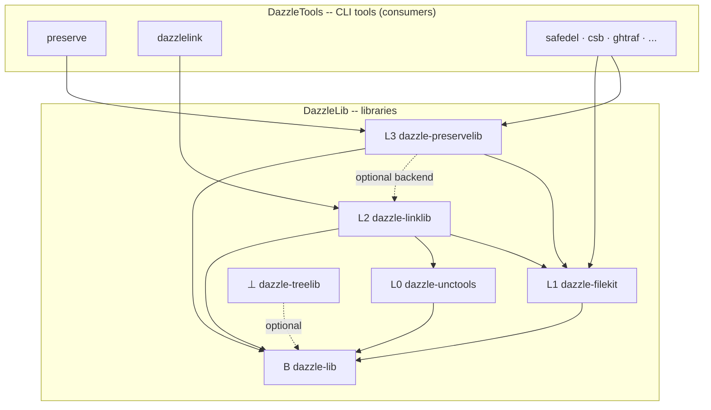

# DazzleLib

**Foundation Libraries for the Dazzle Ecosystem**

[](https://github.com/DazzleLib)
[](https://pypi.org/search/?q=dazzle-)
[](https://opensource.org/licenses/MIT)
[](https://github.com/sponsors/djdarcy)

> High-quality, reusable Python libraries that power [DazzleTools](https://github.com/DazzleTools), [DazzleML](https://github.com/DazzleML), and [DazzleNodes](https://github.com/DazzleNodes).

---

## What is DazzleLib?

**DazzleLib** is a collection of foundational Python libraries designed to solve common development challenges with cross-platform compatibility, robust error handling, and minimal dependencies. Built on principles of composability and clarity, these libraries are the building blocks powering the entire Dazzle ecosystem.

**[Read our design philosophy →](../docs/philosophy.md)**

---

## The Stack

DazzleLib's libraries form a layered stack with one rule above all: **every capability has exactly one home, and dependencies only point down.** The full architecture contract lives in **[STACK-MAP.md](../docs/STACK-MAP.md)** (frozen v1.0, 2026-06-11).

| Layer | Domain | Library | Answers |
|---|---|---|---|
| B | Bedrock contracts | `dazzle-lib` *(in development)* | "What can every stack object do (view/serialize), and what shapes do cross-layer payloads have?" |
| L0 | Path identity | `dazzle-unctools` *(today: `unctools`)* | "Is this path UNC / network / subst / local -- and what is its other name?" |
| L1 | Filesystem primitives | `dazzle-filekit` | "Do ONE thing to ONE filesystem object, correctly, on every OS." |
| L2 | Link serialization | `dazzle-linklib` *(planned -- extracted from the dazzlelink tool)* | "Represent a link as durable portable DATA and rehydrate it anywhere." |
| L3 | Operation orchestration | `dazzle-preservelib` *(planned -- extracted from the preserve tool)* | "Do MANY things as a transaction: manifest, verify, conflict policy." |
| ⊥ | Traversal | `dazzle-treelib` *(today: `dazzletreelib`)* | "Visit a tree efficiently" -- orthogonal engine, usable from any layer. |



The rules in brief: one home per capability · dependencies point down (also the MIT/GPL license guard) · sibling imports are real dependencies (extras need hard, named errors) · libraries live here, CLI tools live in [DazzleTools](https://github.com/DazzleTools) · uniform `dazzle-*` naming on all three axes (dist / import / repo) · migration shims are temporary, noisy, tracked, terminal · names must teach the layer model.

---

## Libraries

### 🧱 [dazzle-lib](https://github.com/DazzleLib/dazzle-lib) [](https://pypi.org/project/dazzle-lib/)
```bash
pip install dazzle-lib
```

**The bedrock: shared Protocols, TypedDict payload schemas, and the exception root**

Structural contracts every stack library builds on -- `Viewable`/`Serializable` protocols, cross-layer payload shapes, one catchable `DazzleError` root. Types only, stdlib only, behavior banned by charter.

**[Full documentation →](https://github.com/DazzleLib/dazzle-lib/tree/main/docs)** | **[Repository →](https://github.com/DazzleLib/dazzle-lib)**

---

### 📁 [dazzle-filekit](https://github.com/DazzleLib/dazzle-filekit) [](https://pypi.org/project/dazzle-filekit/)
```bash
pip install dazzle-filekit
```

**Cross-platform file operations with verification and metadata preservation**

File operations (copy, move, verify) with hash calculation, metadata preservation, and cross-platform path handling including Windows UNC paths.

**[Full documentation →](https://github.com/DazzleLib/dazzle-filekit/tree/main/docs)** | **[Repository →](https://github.com/DazzleLib/dazzle-filekit)**

---

### 🌳 [dazzle-tree-lib](https://github.com/DazzleLib/dazzle-tree-lib) [](https://pypi.org/project/dazzletreelib/)
```bash
pip install dazzletreelib
```

**Tree structure utilities for hierarchical data**

Generic tree data structures with traversal algorithms (DFS, BFS), visualization tools, and path-based operations.

**[Full documentation →](https://github.com/DazzleLib/dazzle-tree-lib/tree/main/docs)** | **[Repository →](https://github.com/DazzleLib/dazzle-tree-lib)**

---

### 🔗 [UNCtools](https://github.com/DazzleLib/UNCtools) [](https://pypi.org/project/unctools/)
```bash
pip install unctools
```

**Windows UNC path handling and network drive utilities**

Parse UNC paths, detect network drives, convert between drive letters and UNC paths, and handle long path names (>260 characters). Cross-platform safe with graceful no-ops on Unix systems.

**[Full documentation →](https://github.com/DazzleLib/UNCtools/tree/main/docs)** | **[Repository →](https://github.com/DazzleLib/UNCtools)**

---

## Quick Start

```python
# File operations with verification
from dazzle_filekit import copy_file, calculate_file_hash

copy_file("source.txt", "dest.txt", preserve_metadata=True)
hash_value = calculate_file_hash("file.txt", algorithm="sha256")

# Tree structures
from dazzletreelib import TreeNode

root = TreeNode("root")
child = root.add_child("child1")

# Windows UNC paths
from unctools import is_unc_path, parse_unc_path

if is_unc_path(r"\\server\share\file.txt"):
    server, share, path = parse_unc_path(r"\\server\share\file.txt")
```

---

## Documentation

Org-level documents live here; per-library documentation lives in each repository's own `docs/` (linked from the sections above), so it stays maintained alongside the code.

- **[Architecture Contract (STACK-MAP)](../docs/STACK-MAP.md)** - The frozen layer model: one home per capability, dependencies point down
- **[Design Philosophy](../docs/philosophy.md)** - Principles and architectural decisions
- **[Library Roadmap](../docs/roadmap.md)** - Current status and planned libraries

---

## Used By

DazzleLib powers these projects in the Dazzle ecosystem:

**[DazzleTools](https://github.com/DazzleTools)**: preserve, dazzlelink, relinker (future)
**[DazzleML](https://github.com/DazzleML)**: File organization and training data management
**[DazzleNodes](https://github.com/DazzleNodes)**: ComfyUI custom nodes file operations

---

## Platform Support

| Library | Windows | Linux | macOS | Python |
|---------|---------|-------|-------|--------|
| dazzle-lib | ✅ Full | ✅ Full | ✅ Full | 3.9+ |
| dazzle-filekit | ✅ Full | ✅ Full | ✅ Full | 3.8+ |
| dazzle-tree-lib | ✅ Full | ✅ Full | ✅ Full | 3.8+ |
| UNCtools | ✅ Full | ⚠️ No-op | ⚠️ No-op | 3.8+ |

---

## Contributing

Contributions are welcome! Each library has its own repository with contribution guidelines.

**General Process**:
1. Fork the library repository
2. Create a feature branch
3. Add tests for new functionality
4. Ensure all tests pass (`pytest`)
5. Submit a pull request

**[Read full contributing guidelines →](CONTRIBUTING.md)**

---

## 💰 Sustainability

**[Learn about supporting DazzleLib →](../docs/sustainability.md)**

If DazzleLib saves you time, consider **[sponsoring on GitHub](https://github.com/sponsors/djdarcy)** or **[buying us a coffee](https://www.buymeacoffee.com/djdarcy)**

---

## Part of DazzleProj

DazzleLib is one of five organizations in the Dazzle ecosystem:

- **[DazzleProj](https://github.com/DazzleProj)** - Ecosystem coordination
- **[DazzleLib](https://github.com/DazzleLib)** - Foundation libraries ← *You are here*
- **[DazzleTools](https://github.com/DazzleTools)** - Command-line tools
- **[DazzleNodes](https://github.com/DazzleNodes)** - ComfyUI custom nodes
- **[DazzleML](https://github.com/DazzleML)** - AI development tools

---

## License

All DazzleLib libraries are released under the **MIT License** for maximum compatibility with both open source and commercial projects.

See individual library repositories for specific license files.

---

## Contact

- **Issues**: Use repository-specific issue trackers
- **Discussions**: [GitHub Discussions](https://github.com/DazzleLib/discussions)
- **Sponsorship**: [GitHub Sponsors](https://github.com/sponsors/djdarcy)
- **Website**: [DazzleProj.com](https://dazzleproj.com) *(coming soon)*

---

**Build better tools with DazzleLib** 🛠️
